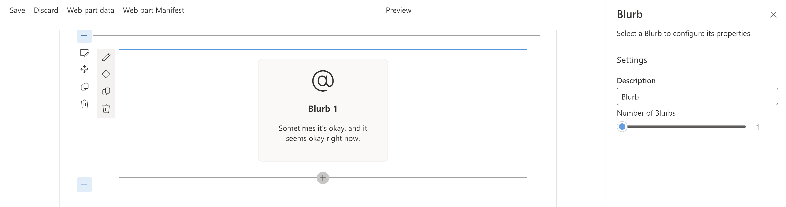

# Blurb Web Part

## Summary

The Blurb web part offers a clean and stylish way to combine text and images. It’s ideal for highlighting key pieces of information, often arranged in rows to effectively present important details.

## Used SharePoint Framework Version

## Applies to

- [SharePoint Framework](https://aka.ms/spfx)

## Version history

| Version | Date             | Comments        |
| ------- | ---------------- | --------------- |
| 0.1.0   | November 29, 2024 | Features and bug fixes |
| 0.0.1   | October 20, 2024  | Inintial test release |

## Disclaimer

**THIS CODE IS PROVIDED _AS IS_ WITHOUT WARRANTY OF ANY KIND, EITHER EXPRESS OR IMPLIED, INCLUDING ANY IMPLIED WARRANTIES OF FITNESS FOR A PARTICULAR PURPOSE, MERCHANTABILITY, OR NON-INFRINGEMENT.**

---

## Blurb Web Part Features

- **Customizable Layout**:
The Blurb web part allows users to display information in up to four customizable content containers. Each container can be independently styled and displayed in a single row, making it easy to organize and present multiple pieces of important content side by side. 

- **Text and Image Combination**:
Each container supports a combination of ~~rich~~ text and imagery. Users can add a title, ~~formatted~~ text, and hyperlinks, making it flexible for various types of content. Whether it’s a brief announcement or detailed information, the Blurb web part adapts to different needs. Rich text editor will be added in a future update.

- **Customizable Appearance**:
You can tailor the appearance of each container by setting different border colors and background colors, ensuring that the Blurb fits seamlessly with the design of your SharePoint page.

- **Icon Options**:
Users have the option to choose between an icon or ~~a custom image~~ for each container. Icons are available for quick selection, while custom images will be added in a future update.

- **Easy Editing Experience**:
The web part includes an intuitive Edit Web Part panel where users can manage and style containers without leaving the edit mode of the page. The layout and design controls are centralized, simplifying customization.

- **Responsive Design**:
The Blurb web part is designed to look great on any device. The content containers adapt to different screen sizes, ensuring a consistent experience for users on desktops, tablets, or mobile devices.

- **Streamlined User Experience**: 
With a layout similar to the default Quick Links web part, the Blurb web part offers a familiar, easy-to-use interface. Users can quickly set up and arrange blurbs to highlight key information effectively.
